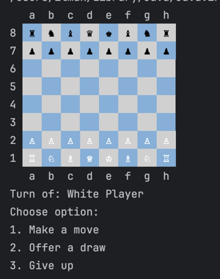

# Console Chess Game

This is a simple chess game that allows two human players to play against each other in a console environment.

## How to Play

1. **Start the Game**: When you run the program, the chessboard will appear in the console. Each square on the board is represented by letters and numbers (e.g., `a1`, `b8`), following standard chess notation.

2. **Turn-based Play**: The game is set up for **human vs. human** play, where each player takes turns making a move.

3. **Options**:
    - **Make a Move**: Players enter moves in chess notation (e.g., `e2 to e4`).
    - **Offer a Draw**: A player can offer a draw if they believe the game is balanced or they want to end it.
    - **Give Up**: A player can resign if they feel they cannot win the game.

4. **Display**: The board updates after each move, showing the current positions of all pieces and indicating whose turn it is.

## Features

- **Chess Notation**: The board and moves follow the standard chess notation for easy understanding.
- **Interactive Gameplay**: Players can interact with the game by choosing options displayed on the screen.
- **Real-time Updates**: After each move, the board updates in the console to reflect the new positions of the pieces.

## Example Gameplay

After each move, the board is displayed with updated positions. A prompt will appear, allowing the current player to:
- Make their next move
- Offer a draw
- Resign from the game

The example screenshot shows the initial setup of the board at the beginning of the game, with White to move.

---
